# Pipelined Dual-Edge MIPS Processor

A fully functional 32-bit MIPS CPU implemented in two architectures — a **multi-cycle FSM** and a **5-stage pipeline** — each written in both **VHDL** and **SystemVerilog**. Targets the Altera MAX 10 FPGA. Verified with GHDL (VHDL) and iverilog (SystemVerilog).

---

## Table of Contents

1. [Repository Structure](#repository-structure)
2. [Supported Instructions](#supported-instructions)
3. [Architecture 1: Multi-Cycle FSM](#architecture-1-multi-cycle-fsm)
4. [Architecture 2: Five-Stage Pipeline](#architecture-2-five-stage-pipeline)
   - [Pipeline Stages & Datapath](#pipeline-stages--datapath)
   - [Pipeline Registers](#pipeline-registers)
   - [Hazard Detection & Handling](#hazard-detection--handling)
   - [Forwarding Unit](#forwarding-unit)
   - [Memory Architecture](#memory-architecture)
   - [Memory-Mapped I/O](#memory-mapped-io)
   - [HI/LO Register Pair](#hilo-register-pair)
5. [ALU Operations](#alu-operations)
6. [Simulation](#simulation)
7. [FPGA Target](#fpga-target)

---

## Repository Structure

```
.
├── VHDL/
│   ├── MIPS_package.vhd          # Shared constants, opcodes, ALU ops, components
│   ├── MIPS_ctrl.vhd             # Multi-cycle FSM controller
│   ├── MIPS_datapath.vhd         # Multi-cycle datapath
│   ├── MIPS_ALU.vhd              # 32-bit ALU (23 operations)
│   ├── ALU_Control.vhd           # ALU opcode decoder
│   ├── MIPS_memory.vhd           # Unified memory with I/O
│   ├── registerfile_v2.vhd       # Synchronous register file
│   ├── MIPS_top_level.vhd        # Multi-cycle top-level
│   ├── decoder7seg.vhd           # 7-segment display decoder
│   ├── pipeline/
│   │   ├── pipe_pkg.vhd          # Pipeline record types & reset constants
│   │   ├── pipe_regfile.vhd      # Async-read register file (WB→ID bypass)
│   │   ├── pipe_imem.vhd         # 256×32 instruction ROM (27-word test program)
│   │   ├── pipe_dmem.vhd         # Data RAM + memory-mapped I/O
│   │   ├── mips_pipeline.vhd     # 5-stage pipeline (main design, ~320 lines)
│   │   └── mips_pipe_top.vhd     # Top-level with 7-segment decoders
│   └── sim/
│       ├── pipeline_tb.vhd       # Self-checking testbench (11 checks)
│       └── run_pipeline_sim.sh   # GHDL compile + run script
│
├── SV/
│   ├── MIPS_package.sv           # Shared constants (SystemVerilog package)
│   ├── decoder7seg.sv            # 7-segment decoder
│   ├── pipeline/
│   │   ├── pipe_pkg.sv           # Packed struct types & forwarding localparams
│   │   ├── pipe_regfile.sv       # Async-read register file
│   │   ├── pipe_imem.sv          # Instruction ROM (same 27-word program)
│   │   ├── pipe_dmem.sv          # Data memory with I/O
│   │   ├── mips_pipeline.sv      # 5-stage pipeline (inline ALU, ~500 lines)
│   │   └── mips_pipe_top.sv      # Top-level wrapper
│   └── sim/
│       ├── pipeline_tb.sv        # SV self-checking testbench (12 checks)
│       └── run_pipeline_sim.sh   # iverilog compile + run script
```

---

## Supported Instructions

| Category       | Instruction      | Description                                |
|----------------|------------------|--------------------------------------------|
| **R-type**     | `addu`           | Add unsigned (no overflow trap)            |
|                | `subu`           | Subtract unsigned                          |
|                | `and`            | Bitwise AND                                |
|                | `or`             | Bitwise OR                                 |
|                | `xor`            | Bitwise XOR                                |
|                | `slt`            | Set if less than (signed)                  |
|                | `sltu`           | Set if less than (unsigned)                |
|                | `sll`            | Shift left logical                         |
|                | `srl`            | Shift right logical                        |
|                | `sra`            | Shift right arithmetic                     |
|                | `mult`           | Signed multiply → HI:LO                   |
|                | `multu`          | Unsigned multiply → HI:LO                 |
|                | `mfhi`           | Move from HI                               |
|                | `mflo`           | Move from LO                               |
|                | `jr`             | Jump register                              |
| **I-type**     | `addiu`          | Add immediate unsigned                     |
|                | `subiu`          | Subtract immediate unsigned                |
|                | `andi`           | AND immediate (zero-extended)              |
|                | `ori`            | OR immediate (zero-extended)               |
|                | `xori`           | XOR immediate (zero-extended)              |
|                | `slti`           | Set if less than immediate (signed)        |
|                | `sltiu`          | Set if less than immediate (unsigned)      |
|                | `lw`             | Load word                                  |
|                | `sw`             | Store word                                 |
|                | `beq`            | Branch if equal                            |
|                | `bne`            | Branch if not equal                        |
|                | `blez`           | Branch if ≤ 0 (signed)                    |
|                | `bgtz`           | Branch if > 0 (signed)                    |
|                | `bltz`           | Branch if < 0 (signed, via `REGIMM`)      |
|                | `bgez`           | Branch if ≥ 0 (signed, via `REGIMM`)      |
| **J-type**     | `j`              | Unconditional jump                         |
|                | `jal`            | Jump and link ($31 ← PC+4)                |

---

## Architecture 1: Multi-Cycle FSM

The multi-cycle design uses a **Mealy/Moore FSM controller** (`MIPS_ctrl.vhd`) paired with a shared datapath (`MIPS_datapath.vhd`). A single memory services both instruction fetch and data access (von Neumann model). Each instruction takes a variable number of clock cycles depending on its type.

### FSM State Diagram

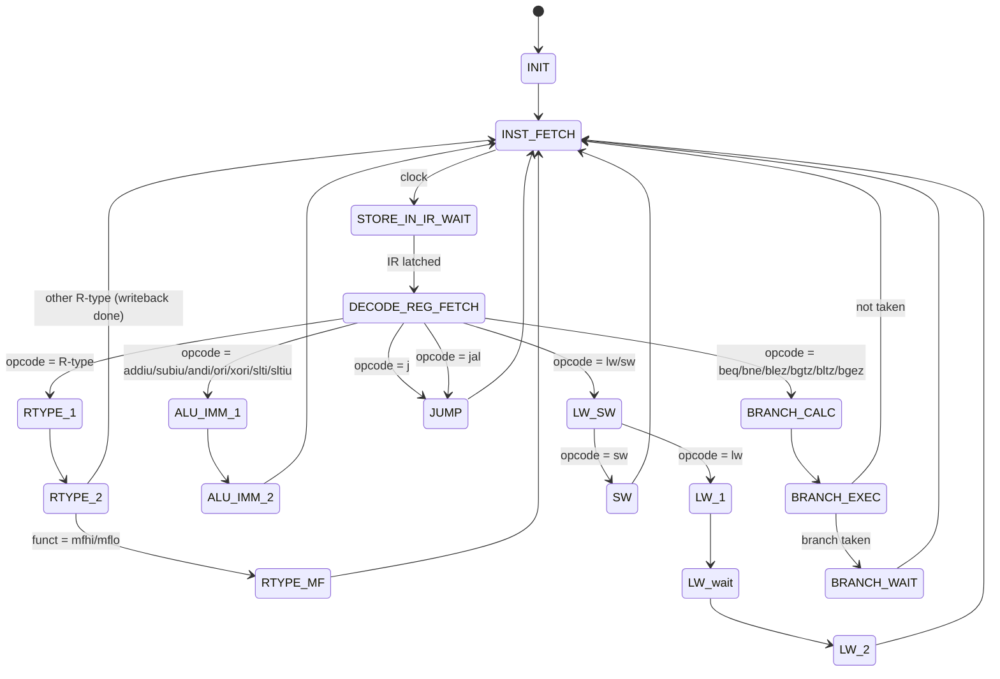

### Multi-Cycle Control Signals

| Signal         | Purpose                                              |
|----------------|------------------------------------------------------|
| `PC_write`     | Unconditionally update PC                            |
| `PC_writeCond` | Update PC if branch condition is met                 |
| `IorD`         | Select instruction address (0) or data address (1)   |
| `Mem_Read`     | Enable memory read                                   |
| `Mem_Write`    | Enable memory write                                  |
| `IRWrite`      | Latch memory output into instruction register        |
| `Mem_ToReg`    | Select MDR (memory data) over ALU result for WB      |
| `RegDst`       | Write to `rd` (R-type) vs `rt` (I-type)             |
| `Reg_Write`    | Enable register file write                           |
| `ALU_SrcA`     | ALU input A: PC (0) or rs (1)                        |
| `ALU_SrcB`     | ALU input B: rt / 4 / sign-ext imm / shift-left imm  |
| `ALU_Op`       | 2-bit code: addu / adds / R-type / other             |
| `PC_Source`    | Next PC: ALU result / branch target / jump target    |
| `JumpAndLink`  | Force write of PC+4 into `$31`                       |
| `IsSigned`     | Sign-extend (1) vs zero-extend (0) immediate         |

### Instruction Cycle Counts (Multi-Cycle)

| Instruction type           | Cycles |
|----------------------------|--------|
| R-type (non-multiply)      | 4      |
| R-type (mfhi/mflo)         | 5      |
| I-type ALU                 | 4      |
| Load word (lw)             | 5      |
| Store word (sw)            | 4      |
| Branch (taken or not)      | 4      |
| Jump / JAL                 | 3      |

---

## Architecture 2: Five-Stage Pipeline

The pipeline processes one instruction per clock cycle under ideal conditions, achieving up to **5× throughput** over the multi-cycle design. It uses a **Harvard architecture** with separate instruction and data memories, eliminating structural hazards between IF and MEM.

### Pipeline Stages & Datapath

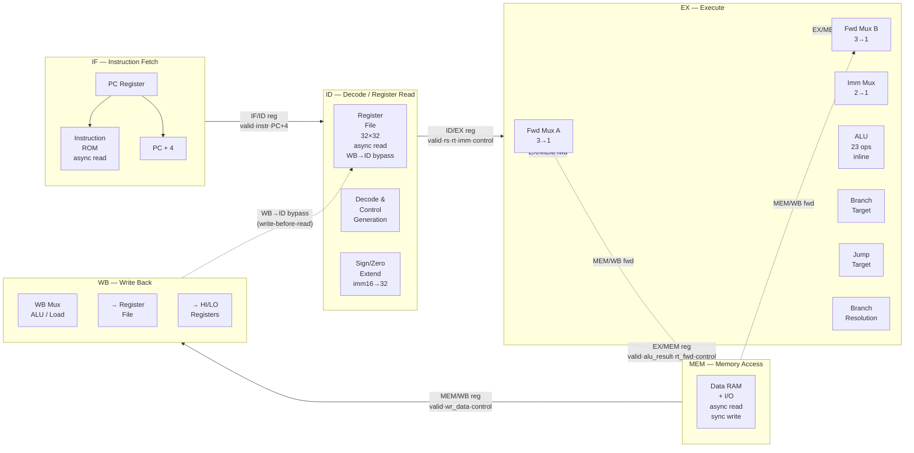

### Pipeline Registers

Each pipeline register carries a **valid bit**. An invalid (bubble) entry commits no side effects — no register write, no memory write, no branch taken.

#### IF/ID Register

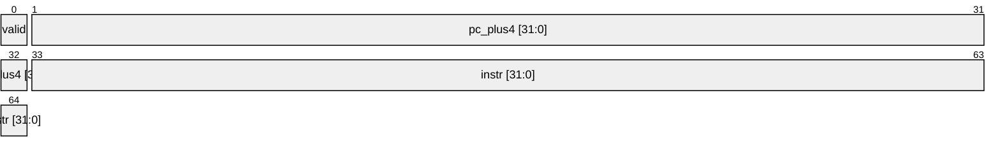

| Field       | Width | Description                              |
|-------------|-------|------------------------------------------|
| `valid`     | 1     | Entry contains a real instruction        |
| `pc_plus4`  | 32    | PC + 4, forwarded for JAL / branch calc |
| `instr`     | 32    | Raw instruction word from IMEM           |

#### ID/EX Register

| Field          | Width | Description                                 |
|----------------|-------|---------------------------------------------|
| `valid`        | 1     | Entry is live                               |
| `pc_plus4`     | 32    | For branch target & JAL return address      |
| `rs_data`      | 32    | Register rs (or HI/LO for mfhi/mflo)        |
| `rt_data`      | 32    | Register rt                                 |
| `imm32`        | 32    | Sign/zero-extended immediate                |
| `rs`, `rt`     | 5     | Source register addresses (for forwarding)  |
| `rd`           | 5     | Writeback destination (after RegDst mux)    |
| `shamt`        | 5     | Shift amount IR[10:6]                       |
| `alu_op`       | 5     | ALU operation select (23 encodings)         |
| `alu_src_b`    | 1     | 0 = register, 1 = immediate                |
| `hi_write`     | 1     | Instruction writes HI (mult/multu)          |
| `lo_write`     | 1     | Instruction writes LO (mult/multu)          |
| `mem_read`     | 1     | Load (LW)                                   |
| `mem_write`    | 1     | Store (SW)                                  |
| `reg_write`    | 1     | Instruction writes a GPR                    |
| `mem_to_reg`   | 1     | 0 = ALU result, 1 = loaded data             |
| `branch`       | 1     | Instruction is a branch                     |
| `branch_type`  | 3     | beq/bne/blez/bgtz/bltz/bgez                 |
| `jump`         | 1     | Unconditional jump (j/jal/jr)               |
| `jump_reg`     | 1     | jr: target is forwarded rs                  |
| `is_jal`       | 1     | jal: write PC+4 to $31                      |

#### EX/MEM Register

| Field            | Width | Description                                  |
|------------------|-------|----------------------------------------------|
| `valid`          | 1     | Entry is live                                |
| `pc_plus4`       | 32    | JAL: PC+4 stored here as writeback value     |
| `alu_result`     | 32    | ALU output (LO word for mult; PC+4 for JAL) |
| `alu_result_hi`  | 32    | HI word from mult/multu                      |
| `rt_fwd`         | 32    | Forwarded rt value — store data for SW       |
| `rd`             | 5     | Writeback destination                        |
| `mem_read`       | 1     | LW pending                                   |
| `mem_write`      | 1     | SW pending                                   |
| `reg_write`      | 1     | GPR write pending                            |
| `mem_to_reg`     | 1     | Select load data over ALU result             |
| `hi_write`       | 1     | Write HI in WB                               |
| `lo_write`       | 1     | Write LO in WB                               |
| `is_load`        | 1     | Load-use hazard detection next cycle         |
| `take_branch`    | 1     | Branch is taken — flush IF/ID & ID/EX        |
| `take_jump`      | 1     | Jump is taken — flush IF/ID & ID/EX          |
| `pc_target`      | 32    | New PC if branch/jump taken                  |

#### MEM/WB Register

| Field        | Width | Description                                  |
|--------------|-------|----------------------------------------------|
| `valid`      | 1     | Entry is live                                |
| `wr_data`    | 32    | Data to write to GPR (ALU result or load)    |
| `wr_data_hi` | 32    | HI register write data                       |
| `rd`         | 5     | Writeback destination register               |
| `reg_write`  | 1     | Enable GPR write                             |
| `hi_write`   | 1     | Enable HI write                              |
| `lo_write`   | 1     | Enable LO write                              |

---

### Hazard Detection & Handling

The pipeline uses a dedicated **hazard detection unit** that combinatorially inspects the pipeline registers and issues stall or flush signals. Three categories of hazards are handled.

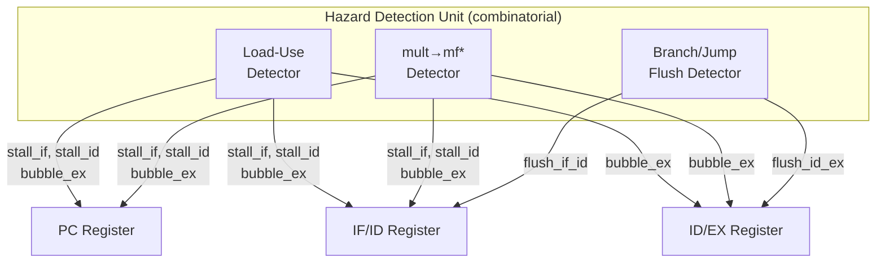

#### Hazard 1: Load-Use Data Hazard (1-cycle stall)

Occurs when a load (`lw`) is in the EX stage and the immediately following instruction reads the loaded register before it has been written back.

**Detection condition:**
```
id_ex_reg.mem_read = '1'   AND
id_ex_reg.valid    = '1'   AND
id_ex_reg.rd      ≠ $0     AND
(id_ex_reg.rd = if_id_reg.instr[25:21]  OR   -- rs of ID instruction
 id_ex_reg.rd = if_id_reg.instr[20:16])      -- rt of ID instruction
```

**Response:** Hold PC (stall_if), hold IF/ID (stall_id), insert NOP bubble into ID/EX (bubble_ex).

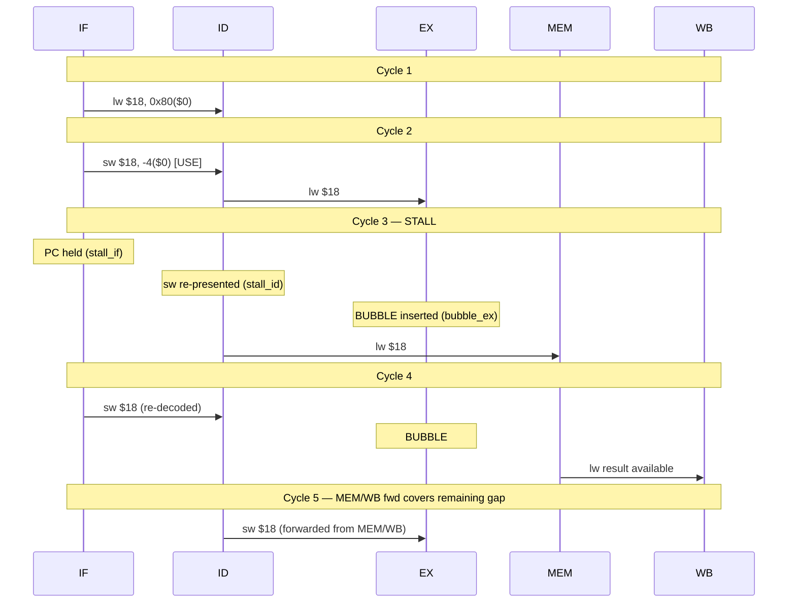

#### Hazard 2: mult → mfhi/mflo Stall (1-cycle stall)

`mult`/`multu` write HI/LO in the **WB** stage (two cycles after EX). If `mfhi` or `mflo` is decoded in ID while `mult` is still in EX, the HI/LO value is not yet available.

**Detection condition:**
```
id_ex_reg.valid                           = '1'  AND
(id_ex_reg.hi_write OR id_ex_reg.lo_write) = '1'  AND   -- mult in EX
if_id_reg.valid                           = '1'  AND
if_id_reg.instr[31:26]                    = R_OP AND
(if_id_reg.instr[5:0] = R_FUNC_MFHI OR
 if_id_reg.instr[5:0] = R_FUNC_MFLO)
```

**Response:** Same signals as load-use — stall_if, stall_id, bubble_ex. The 1-cycle bubble gives mult time to reach MEM, so HI/LO are written in WB before mfhi/mflo reads them.

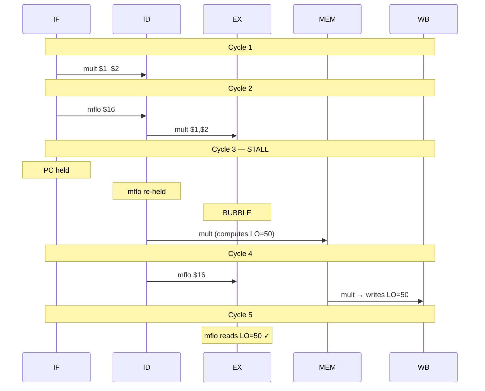

#### Hazard 3: Branch / Jump Control Hazard (2-cycle flush)

Branches are **resolved in the EX stage**. By the time the branch outcome is known, two younger instructions have already entered IF and ID — these are wrong-path instructions and must be discarded.

**Detection condition:**
```
ex_mem_reg.valid                              = '1'  AND
(ex_mem_reg.take_branch OR ex_mem_reg.take_jump) = '1'
```

**Response:** Set flush_if_id (clear IF/ID valid) and flush_id_ex (clear ID/EX valid). Override any pending load-use stall (stall_if/stall_id/bubble_ex all cleared).

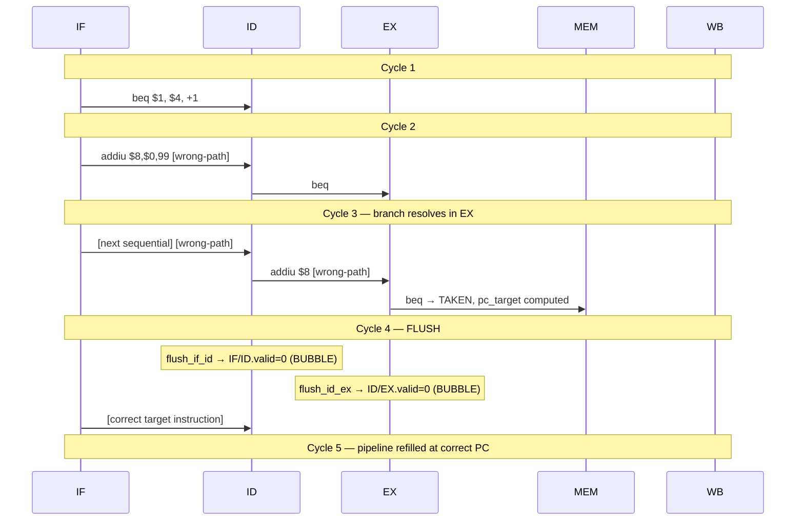

**Branch priority over stall:** If a branch flush and a load-use stall would both fire in the same cycle, the branch flush takes priority — the wrong-path instruction in ID is discarded anyway, so holding it makes no sense.

#### Hazard Priority Summary

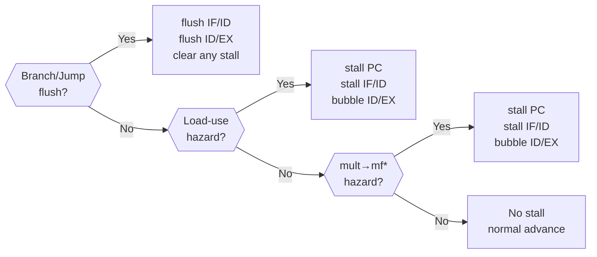

---

### Forwarding Unit

Full **data forwarding** eliminates the need for stalls in all cases except load-use and mult→mfhi/mflo. The forwarding unit runs combinatorially and drives 2-bit mux selects for ALU inputs A and B.

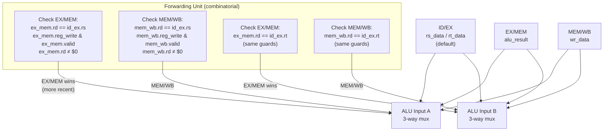

**Forwarding mux encodings:**

| `fwd_a` / `fwd_b` | Source           | Cycles ago |
|--------------------|------------------|------------|
| `2'b00`            | ID/EX (register) | current    |
| `2'b01`            | EX/MEM ALU result | 1 cycle   |
| `2'b10`            | MEM/WB write data | 2 cycles  |

**WB → ID bypass (register file):** The async-read register file implements write-before-read forwarding internally. When the WB stage writes a register at the same address as an ID-stage read, the new value is returned immediately — this handles the case where an instruction three cycles earlier writes a value needed by the current ID instruction.

**$0 forwarding guard:** Forwarding is never asserted when the writeback destination is `$0`, since `$0` is hardwired to zero and writes to it are silently discarded.

**SW store data forwarding:** The forwarded `rt` value (`ex_rt_fwd`) is stored in the EX/MEM register as `rt_fwd` specifically for store instructions. This ensures a store that follows a load or ALU instruction always sees the correct data to write.

---

### Memory Architecture

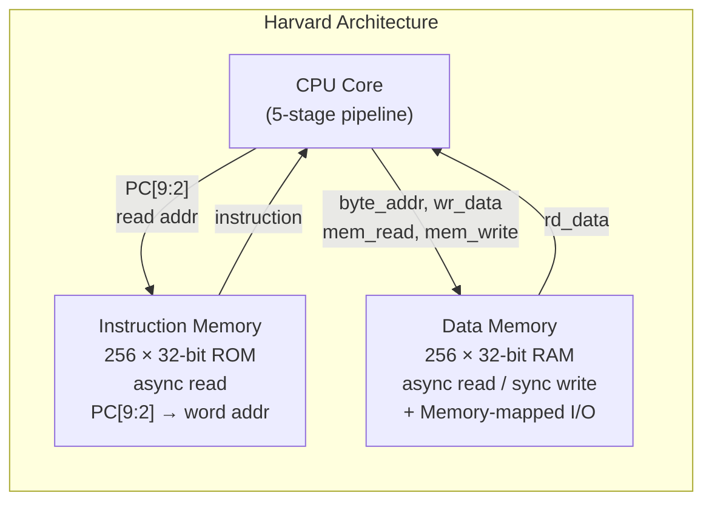

The Harvard split means the IF and MEM stages access completely separate memories — there is no structural hazard between them, and no extra stall cycle is ever needed for memory access.

**Instruction Memory (`pipe_imem`):**
- 256-word (1 KB) ROM
- Asynchronous (combinatorial) read — instruction available in the same cycle the PC is applied
- Loaded with a 27-word test program at synthesis/simulation time

**Data Memory (`pipe_dmem`):**
- 256-word (1 KB) RAM, word-addressed (byte address right-shifted by 2)
- Asynchronous reads — load data available before the next clock edge (single-cycle latency, no extra stall)
- Synchronous writes — store committed on the rising clock edge in the MEM stage
- Memory-mapped I/O registers overlaid at the top of the address space

---

### Memory-Mapped I/O

```mermaid
block-beta
    columns 1
    block:io["I/O Address Space (16-bit decode)"]
        inport0["0xFFF8 — InPort0 (read-only)\nbit[8:0] ← switches[8:0]"]
        inport1["0xFFFA — InPort1 (read-only)\nbit[8:0] ← switches[8:0]"]
        outport["0xFFFC — OutPort (write-only)\ndrives LEDs and 7-segment display"]
    end
    block:ram["Normal RAM\n0x0000 – 0xFFF7"]
    end
```

| Address  | Direction | Signal          | Description                          |
|----------|-----------|-----------------|--------------------------------------|
| `0xFFF8` | Read      | `switches[8:0]` | InPort0 — 9 slide switches           |
| `0xFFFA` | Read      | `switches[8:0]` | InPort1 — same switches, alternate   |
| `0xFFFC` | Write     | `out_port`      | OutPort — drives LEDs & 7-seg        |

Writing to `0xFFFC` (e.g., `sw $3, -4($0)`) updates the OutPort register, which is routed to the on-board LEDs and decoded into six 7-segment displays on the top-level wrapper.

---

### HI/LO Register Pair

The `HI` and `LO` registers hold the 64-bit result of `mult`/`multu` split across two 32-bit halves.

**Write path:** HI and LO are written **in the WB stage** from the MEM/WB register fields `wr_data_hi` (HI) and `wr_data` (LO).

**Read path:** `mfhi` and `mflo` are decoded in the ID stage. The decode logic overrides `rs_data` with `HI_reg` or `LO_reg` before the value is latched into the ID/EX register.

**Stall requirement:** Because HI/LO are not written until WB, a `mult` immediately followed by `mfhi`/`mflo` requires a 1-cycle stall (the mult→mf* hazard described above). Forwarding of HI/LO values is not implemented; the stall guarantees correctness.

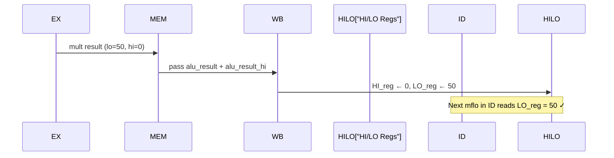

---

## ALU Operations

The ALU supports 23 distinct operations, selected by a 5-bit `OPSelect` code. It implements both a standard result path and a branch-taken flag output, used by all branch instructions.

| Code     | Mnemonic                | Operation                              |
|----------|-------------------------|----------------------------------------|
| `00000`  | `ALU_ADD_unsign`        | A + B (unsigned)                       |
| `00001`  | `ALU_ADD_sign`          | A + B (signed)                         |
| `00010`  | `ALU_SUB_unsign`        | A - B (unsigned)                       |
| `00011`  | `ALU_SUB_sign`          | A - B (signed)                         |
| `00100`  | `ALU_mult_unsign`       | A × B unsigned → {HI, LO}             |
| `00101`  | `ALU_mult_sign`         | A × B signed → {HI, LO}               |
| `00110`  | `ALU_AND`               | A AND B                                |
| `00111`  | `ALU_OR`                | A OR B                                 |
| `01000`  | `ALU_XOR`               | A XOR B                                |
| `01001`  | `ALU_NOT_A`             | NOT A                                  |
| `01010`  | `ALU_LOG_SHIFT_R`       | B >> shamt (logical)                   |
| `01011`  | `ALU_LOG_SHIFT_L`       | B << shamt (logical)                   |
| `01100`  | `ALU_ARITH_SHIFT_R`     | B >>> shamt (arithmetic)               |
| `01101`  | `ALU_comp_A_lt_B_unsign`| A < B ? 1 : 0 (unsigned)               |
| `01110`  | `ALU_comp_A_lt_B_sign`  | A < B ? 1 : 0 (signed)                 |
| `01111`  | `ALU_A_gt_0`            | branch_taken = (A > 0) signed          |
| `10000`  | `ALU_A_eq_0`            | branch_taken = (A == 0) signed         |
| `10001`  | `ALU_gteq_0`            | branch_taken = (A >= 0) signed         |
| `10010`  | `ALU_lteq_0`            | branch_taken = (A <= 0) signed         |
| `10011`  | `ALU_A_eq_B`            | branch_taken = (A == B)                |
| `10100`  | `ALU_A_ne_B`            | branch_taken = (A != B)                |
| `10101`  | `ALU_A_lt_0`            | branch_taken = (A < 0) signed          |
| `10110`  | `ALU_PASS_A_BRANCH`     | result = A (mfhi, mflo, jr)            |
| `10111`  | `ALU_PASS_B_BRANCH`     | result = B                             |
| `11111`  | `ALU_NOP`               | No operation / bubble                  |

---

## Simulation

### VHDL — GHDL

```bash
# From project root
bash VHDL/sim/run_pipeline_sim.sh

# With waveform output (opens with gtkwave)
bash VHDL/sim/run_pipeline_sim.sh --wave
gtkwave VHDL/sim/pipeline_wave.vcd
```

Requires GHDL ≥ 0.37 with VHDL-2008 support (`--std=08` for `process(all)` sensitivity syntax).

**All 11 checks pass** in ~1.1 µs of simulation time:

| Check                                     | Expected | Description                                  |
|-------------------------------------------|----------|----------------------------------------------|
| Phase 1 OutPort                           | `0x0F`   | addu+beq taken, word 8 skipped, forwarding  |
| Phase 1 — word 8 NOT committed            | —        | Confirms branch flush works                  |
| Phase 2 OutPort                           | `0x02`   | xori with zero-extend                        |
| Phase 3 OutPort                           | `0x01`   | slti                                         |
| Phase 4 OutPort                           | `0x05`   | bne taken, word 17 skipped                   |
| Phase 5 OutPort                           | `0x32`   | mult + mflo stall → 50 decimal              |
| Phase 6 OutPort                           | `0x4D`   | lw → sw load-use stall → 77 decimal         |
| Loop2 Phase 1                             | `0x0F`   | j flush + second iteration                  |
| Loop2 Phase 6                             | `0x4D`   | Second iteration stable                      |
| EX/MEM forwarding                         | —        | Confirmed by Phase 1 correctness             |
| MEM/WB forwarding                         | —        | Confirmed by Phase 1 correctness             |

### SystemVerilog — iverilog

```bash
# From project root
bash SV/sim/run_pipeline_sim.sh

# With waveform output
bash SV/sim/run_pipeline_sim.sh --wave
gtkwave SV/sim/pipeline_wave.vcd
```

Requires iverilog ≥ 11 (`iverilog -g2012`).

**All 12 checks pass:**

| Check                                     | Expected | Description                                  |
|-------------------------------------------|----------|----------------------------------------------|
| `$zero` hardwired                         | —        | Structural guarantee from pipe_regfile        |
| Phase 1 OutPort                           | `0x0F`   | addu+beq taken, word 8 skipped               |
| Phase 1 — word 8 NOT committed            | —        | Branch flush verification                     |
| Phase 2 OutPort                           | `0x02`   | xori                                          |
| Phase 3 OutPort                           | `0x01`   | slti                                          |
| Phase 4 OutPort                           | `0x05`   | bne taken                                     |
| Phase 5 OutPort                           | `0x32`   | mult+mflo with stall                          |
| Phase 6 OutPort                           | `0x4D`   | load-use stall                               |
| Loop2 Phase 1                             | `0x0F`   | j flush + second loop                        |
| Loop2 Phase 6                             | `0x4D`   | Second iteration                              |
| EX/MEM forwarding                         | —        | Confirmed by Phase 1                         |
| MEM/WB forwarding                         | —        | Confirmed by Phase 1                         |

### Test Program

The 27-instruction program embedded in `pipe_imem.vhd` / `pipe_imem.sv` exercises every hazard class and control-flow path:

```asm
; Phase 1 — forwarding, beq taken (2-cycle flush)
word 0:  addiu $1,  $0,  5         ; $1 = 5
word 1:  addiu $2,  $0, 10         ; $2 = 10
word 2:  addu  $3,  $1, $2         ; $3 = 15  (EX/MEM fwd: $1 from word 0→1)
word 3:  subu  $4,  $2, $1         ; $4 = 5
word 4:  and   $5,  $1, $2         ; $5 = 0
word 5:  or    $6,  $1, $2         ; $6 = 15
word 6:  sll   $7,  $1, 2          ; $7 = 20
word 7:  beq   $1,  $4, +1         ; $1==5==$4 → TAKEN, skip word 8
word 8:  addiu $8,  $0, 99         ; [NEVER EXECUTED — flushed]
word 9:  sw    $3,  -4($0)         ; OutPort = 15

; Phase 2 — xori (zero-extend immediate)
word 10: ori   $8,  $0, 0xF0       ; $8 = 240
word 11: xori  $10, $1, 7          ; $10 = 5 XOR 7 = 2
word 12: sw    $10, -4($0)         ; OutPort = 2

; Phase 3 — slti
word 13: srl   $11, $7, 2          ; $11 = 5
word 14: slti  $12, $1, 8          ; $12 = (5 < 8) = 1
word 15: sw    $12, -4($0)         ; OutPort = 1

; Phase 4 — bne taken (2-cycle flush)
word 16: bne   $1,  $2, +1         ; $1≠$2 → TAKEN, skip word 17
word 17: addiu $15, $0, 99         ; [NEVER EXECUTED — flushed]
word 18: sw    $1,  -4($0)         ; OutPort = 5

; Phase 5 — mult + mflo (1-cycle stall)
word 19: mult  $1,  $2             ; HI:LO = 5×10 = 50
word 20: mflo  $16                 ; $16 = 50  [stall: mult still in EX]
word 21: sw    $16, -4($0)         ; OutPort = 50

; Phase 6 — load-use stall
word 22: addiu $17, $0, 77         ; $17 = 77
word 23: sw    $17, 0x80($0)       ; mem[0x20] = 77
word 24: lw    $18, 0x80($0)       ; $18 = 77  [LOAD]
word 25: sw    $18, -4($0)         ; OutPort = 77  [USE — 1-cycle stall inserted]

; Loop
word 26: j     0                   ; jump to word 0 [2-cycle flush]
```

---

## FPGA Target

**Device:** Intel/Altera MAX 10 FPGA

**Top-level I/O (pipeline version):**

| Port        | Direction | Width | Description                          |
|-------------|-----------|-------|--------------------------------------|
| `clk`       | in        | 1     | System clock (50 MHz on MAX 10)      |
| `rst`       | in        | 1     | Active-high synchronous reset        |
| `switches`  | in        | 10    | Slide switches → InPort0/InPort1     |
| `button`    | in        | 2     | Push buttons (active-low)            |
| `LEDs`      | out       | 32    | OutPort register                     |
| `led0..5`   | out       | 7×6  | Six 7-segment display cathodes       |
| `led0_dp..5_dp` | out   | 6    | Decimal point signals                |

The 7-segment displays decode the OutPort as six hexadecimal digits, driven by six instances of `decoder7seg`.
